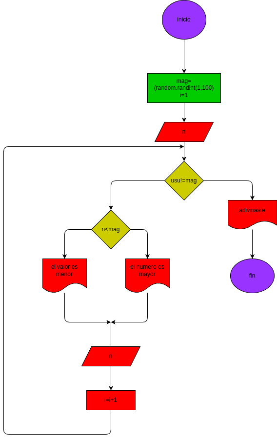

# adivina_el_numero
si adivinas el numero ganas

## analisis

### input

### variables de entrada

usu: el numero el numero que escoje el usuario

## processing
maq=random.randint(1,100)

i=1

while usu!= maq:

  if usu<maq:
        print("fallaste,el numero que toca adivinar es mayor,intenta de nuevo") 
        usu=int(input("dijite su numero"))
        i=i+1

  else: 
        print("fallaste el numeo es menor,intentalo de nuevo")
        usu=int(input("dijite su numero"))
        i=i+1

if usu==maq:
    print("adivinaste,te tomo" +str(i)+ "intentos")

## output
adivinaste te tomo +str(i)+ "intentos"

# diseño
"diagrama de flujo"

